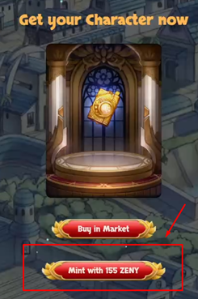

# ❓ How To ( TESTNET BSC )

1. Assuming you already have your metamask account, so go to your Metamask account Settings > Network > Add Network
2.  Fill in the testnet details as below and save it.

    URL: [https://testnet.bscscan.com](https://testnet.bscscan.com)

    New RPC Url: [https://data-seed-prebsc-1-s1.binance.org:8545/](https://data-seed-prebsc-1-s1.binance.org:8545)

.png>)

3\. Ensure that you have connected to the correct network.

.png>)

4\. Go to [https://testnet.binance.org/faucet-smart](https://testnet.binance.org/faucet-smart) and **Insert your BNB address** and click on **Give me BNB**. You will receive your BNB after 1 minutes.

5\. Open [https://beta.bnbro.io/](https://beta.bnbro.io) and connect your wallet.

.png>)

6\. Once you have connected and click on Buy ZENY

.png>)

7\. New windows will coming and go the pancakeswap as below and check box I understand and continue

.png>)

8\. If you are already connected to the Pancakeswap you may skip these steps. If not you need to unlock your wallet, Click Next and Connect and once it connected, you will see the swap button

.png>)

9\. Click on the Mini setting button and change the slippage to 20% close it and Swap your BNB to ZENY

.png>)

10, Now, back to [https://beta.bnbro.io/](https://beta.bnbro.io)and refresh the page you will see the ZENY there

.png>)
