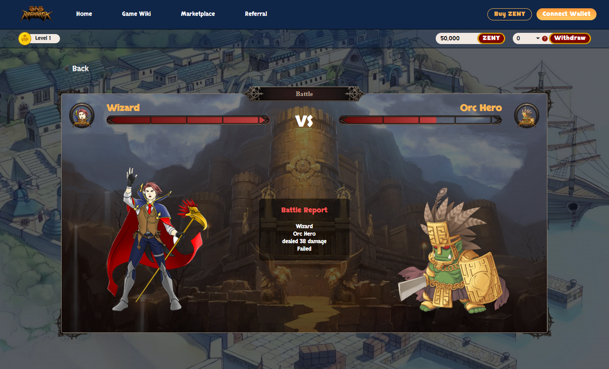

# ⚔ Player Versus Environment (PvE)

Players can join by clicking "Fight" to play. Players exploit their knowledge to arrange formations and defeat enemies.


_Percentage Winning_ will _increase_ the chance by a _percentage_ of the _total stat_.

**Attack, Armor, and Crit.**



Rewards will be adjusted




### <mark style="color:green;">**Monster**</mark><mark style="color:green;">: Poring</mark>

#### **Min Level**: 1

#### **Required HP**: 200

#### **Exp Gain: 200**

#### **Chance**: 61%

#### Rewards : 0.0025BNB + 0.0005BNB in ZENY

### &#x20;<mark style="color:green;">**Monster**</mark><mark style="color:green;">: Poporing</mark>

#### **Min Level**: 1

#### **Required HP**: 200

#### **Exp Gain: 210**

#### **Chance**: 57%

#### Rewards : 0.0030BNB + 0.0005BNB in ZENY

### &#x20;<mark style="color:green;">**Monster**</mark><mark style="color:green;">: King Poring</mark>

#### **Min Level**: 1

#### **Required HP**: 200

#### **Exp Gain: 220**

#### **Chance**: 53%

#### Rewards : 0.0035BNB + 0.0005BNB in ZENY



### <mark style="color:orange;">**Monster**</mark><mark style="color:orange;">:</mark> <mark style="color:orange;"></mark><mark style="color:orange;"><mark style="color:green;"><mark style="color:green;"></mark> <mark style="color:orange;"></mark><mark style="color:orange;">Ant Egg</mark>

#### **Min Level**: 2

#### **Required HP**: 200

#### **Exp Gain: 200**

#### **Chance**: 51%

#### Rewards : 0.007BNB + 0.0005BNB in ZENY

### &#x20;<mark style="color:orange;">**Monster**</mark><mark style="color:orange;">:</mark> <mark style="color:green;"></mark> <mark style="color:orange;">Deniro</mark>

#### **Min Level**: 2

#### **Required HP**: 200

#### **Exp Gain: 250**

#### **Chance**: 57%

#### Rewards : 0.0075BNB + 0.0005BNB in ZENY

### &#x20;<mark style="color:orange;">**Monster**</mark><mark style="color:orange;">:</mark> <mark style="color:green;"></mark> <mark style="color:orange;">Maya Purple</mark>

#### **Min Level**: 2

#### **Required HP**: 300

#### **Exp Gain: 400**

#### **Chance**: 41%

#### Rewards : 0.008BNB + 0.0005BNB in ZENY



### <mark style="color:orange;">**Monster**</mark><mark style="color:orange;">:</mark> <mark style="color:orange;"></mark><mark style="color:orange;"><mark style="color:green;"><mark style="color:green;"></mark> <mark style="color:orange;"></mark><mark style="color:purple;"><mark style="color:orange;">Deviling<mark style="color:orange;"></mark>

#### **Min Level**: 10

#### **Required HP**: 500

#### **Exp Gain: 1000**

#### **Chance**: 35%

#### Rewards : 0.1BNB + 0.1BNB in ZENY

### &#x20;<mark style="color:orange;">**Monster**</mark><mark style="color:orange;">:</mark> <mark style="color:orange;"></mark><mark style="color:orange;"><mark style="color:green;"><mark style="color:green;"></mark> <mark style="color:orange;"></mark><mark style="color:orange;">Baphomet</mark>

#### **Min Level**: 15

#### **Required HP**: 500

#### **Exp Gain: 1000**

#### **Chance**: 35%

#### Rewards : 0.2BNB + 0.2BNB in ZENY

### &#x20;<mark style="color:orange;">**Monster**</mark><mark style="color:orange;">:</mark> <mark style="color:orange;"></mark><mark style="color:orange;"><mark style="color:green;"><mark style="color:green;"></mark> <mark style="color:orange;"></mark><mark style="color:orange;">Osiris</mark>

#### **Min Level**: 15

#### **Required HP**: 500

#### **Exp Gain: 1000**

#### **Chance**: 35%

#### Rewards : 0.3BNB + 0.3BNB in ZENY

### &#x20;<mark style="color:orange;">**Monster**</mark><mark style="color:orange;">:</mark> <mark style="color:orange;"></mark><mark style="color:orange;"><mark style="color:green;"><mark style="color:green;"></mark> <mark style="color:orange;"></mark><mark style="color:orange;">Drake</mark>

#### **Min Level**: 15

#### **Required HP**: 500

#### **Exp Gain: 1000**

#### **Chance**: 35%

#### Rewards : 0.4BNB + 0.4BNB in ZENY



### ****

